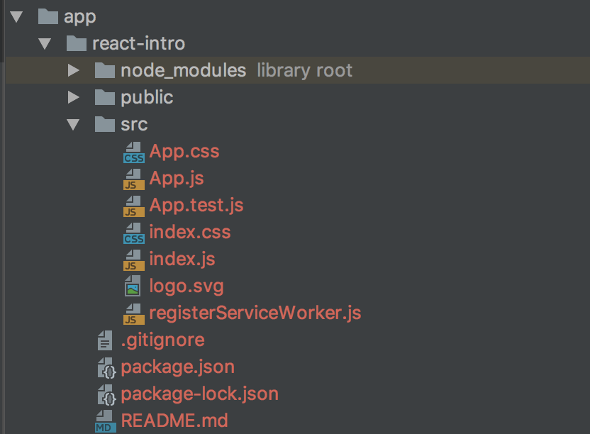

# React firebase and more

If you are into front-end development I bet you heard about REACT JS.  
This unique framework is becoming an industry standard. If you want to know more on how to use it stick to this tutorial and we will unveal the basics, createa production ready application and intgrate it with *real-time database* provided by __FIREBASE__.

### For starters, let's explain what actually is __REACT__ and __FIREBASE__, how it works and how can we utilize it.
  

__REACT__ is a JavaScript Library for building interfaces created by __FACEBOOK__ developers. In short it creates a virtual DOM that is updated whenever some state of your application changes.
It is optimized for performence as it re-renders only elements of the DOM affected by the change.  
  
  

__FIREBASE__ is a *BAAS* (backend as a service) that provides a lot of useful tools for mobile and web development. In it's offer we can find Hosting (even for node apps), real-time database (what we are interested in), authentication using E-mail, __Facebook__ or __Google__.


### Creating FIREBASE project.
For this little tutorial we will create new __FIREBASE__ project, you can do that [here](https://console.firebase.google.com/u/0/).
 After that got to database Tab in your project and to the Rules. You need tochange the rules so we can actualy write something to the DB.
 Your rules should look something like this:  
 ```json
 {
   "rules": {
     ".read": "auth == null",
     ".write": "auth == null"
   }
 }
 ```
  
 Ok, lets talk code.
 What dependencies will we need? 
 ```node
npm intall -g create-react-app 
```
We install react-scripts for tests purposes.
You can read more about it [here](https://github.com/facebook/create-react-app/blob/master/packages/react-scripts/template/README.md).  
Lets also add some scripts to our package.json file.

# React firebase and more

If you are into front-end development I bet you heard about REACT JS.  
This unique framework is becoming an industry standard. If you want to know more on how to use it stick to this tutorial and we will unveal the basics, createa production ready application and intgrate it with *real-time database* provided by __FIREBASE__.

### For starters, let's explain what actually is __REACT__ and __FIREBASE__, how it works and how can we utilize it.
  

__REACT__ is a JavaScript Library for building interfaces created by __FACEBOOK__ developers. In short it creates a virtual DOM that is updated whenever some state of your application changes.
It is optimized for performence as it re-renders only elements of the DOM affected by the change.  
  
  

__FIREBASE__ is a *BAAS* (backend as a service) that provides a lot of useful tools for mobile and web development. In it's offer we can find Hosting (even for node apps), real-time database (what we are interested in), authentication using E-mail, __Facebook__ or __Google__.


### Creating FIREBASE project.
For this little tutorial we will create new __FIREBASE__ project, you can do that [here](https://console.firebase.google.com/u/0/).
 After that got to database Tab in your project and to the Rules. You need tochange the rules so we can actualy write something to the DB.
 Your rules should look something like this:  
 ```json
 {
   "rules": {
     ".read": "auth == null",
     ".write": "auth == null"
   }
 }
 ```
  
 Ok, lets talk code.
 What dependencies will we need?
 We will use [*Create React App*](https://github.com/facebook/create-react-app/tree/master)
 To install all dependencies run:  
 ```node
 npm install --global reate-react-app
```

Then in directory where you want your project to live run:
```node
npx create-react-app react-intro
```

You will end up with folder structure like one below:



